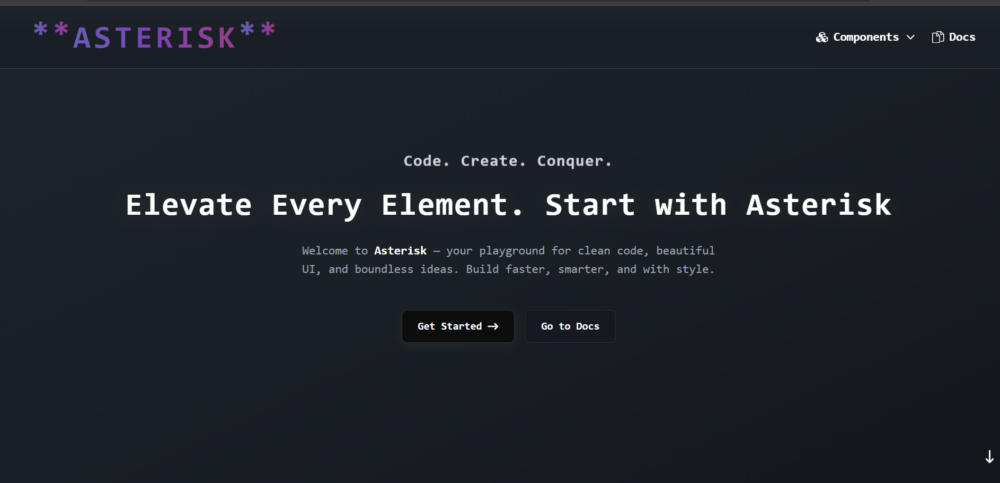
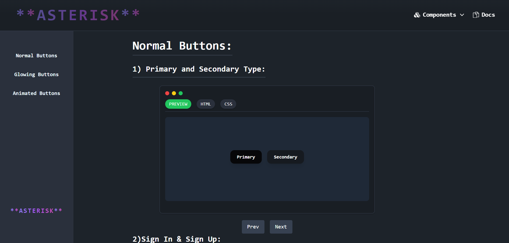
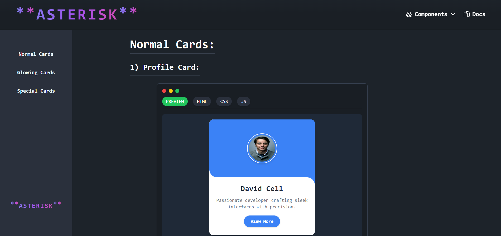
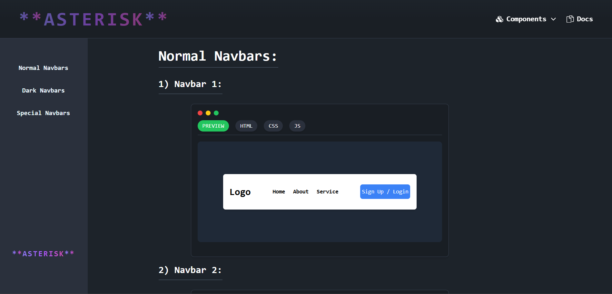
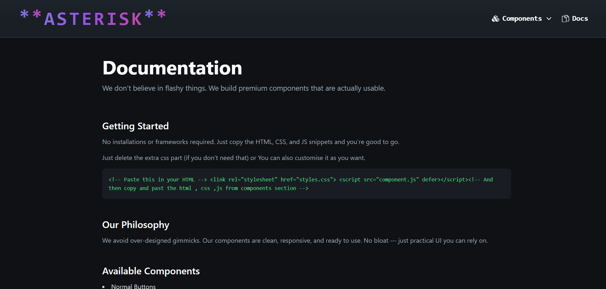

# ✨ Asterisk

Asterisk is a modern, responsive web experience built with **Vite + React**, designed for speed, interactivity, and a smooth UI/UX.  
It combines elegant design with optimized performance to create a seamless browsing experience.  

Users may obtain the **HTML, CSS, and JavaScript code** of individual components they prefer, enabling customization and integration into their own projects.

---

## 🚀 Live Demo
[View Asterisk](https://Subham777-max.github.io/Asterisk/)

---

## 📸 Screenshots

### 1️⃣ Landing Page

### 2️⃣ Buttons Section

### 3️⃣ Cards Section

### 4️⃣ Navbar Page

### 4️⃣ Contact Page

---

## 🛠️ Tech Stack
- **Frontend:** React (Vite)
- **Styling:** CSS / Tailwind CSS
- **Deployment:** GitHub Pages

---